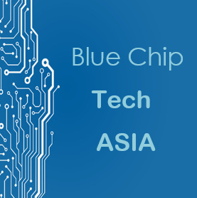
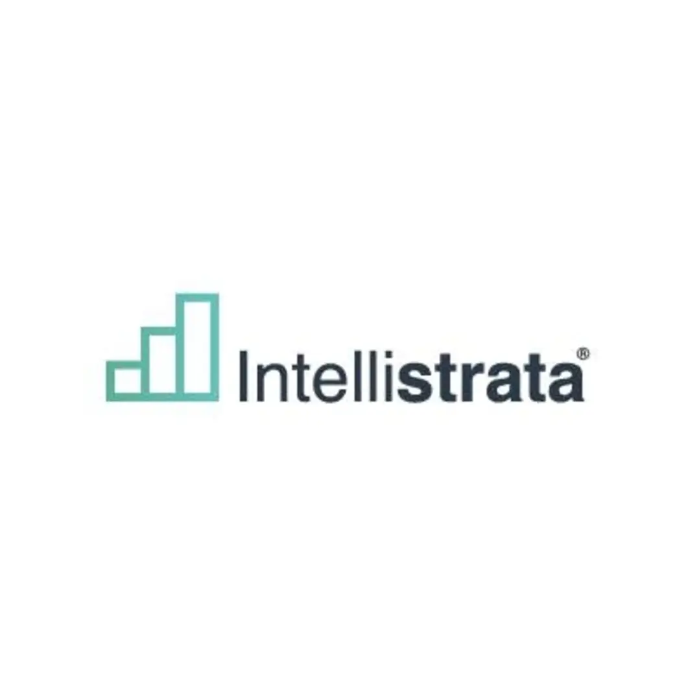

## Bluechip Technologies Asia
- *Machine Learning Intern* | Nov 2023 - June 2024
- 
- Tags: Bluechip Technologies Asia
- Badges:
  - Internship [blue]
- List Items:
  - Applied deep learning techniques for tasks like image recognition, natural language processing, and time series forecasting.
  - Trained and evaluated deep learning models on real-world datasets.
  - Gained experience with popular deep learning frameworks like TensorFlow and PyTorch.

## LAYOUTindex
- *Full-Stack Developer Intern* | Jul 2023 - Sep 2023
- 
- Tags: LAYOUTindex 
- Badges:
  - Internship [blue]
- List Items:
  - Full-Stack Development: Built and maintained web applications using modern technologies like JavaScript, React, Nest.js, MongoDB, and AWS DynamoDB.
  - Performance Optimization: Prioritized optimal performance and user experience through code optimization and scaling strategies.
  - Collaboration & Communication: Effectively collaborated with cross-functional teams on designing, implementing, and reviewing features.

## Intellistrata 
- *AI Engineer* | Aug'24 - Present
- 
- Tags: Intellistrata
- Badges:
  - AI Engineer [blue]
- List Items:
  - Developed Advanced Machine Learning Models: Created and deployed machine learning models using Python and OpenAI APIs to enhance data-driven decision-making processes across various business units.
  - AI-Powered Automation: Engineered AI-based automation tools using n8n and Python, optimizing workflow efficiency and reducing manual intervention by 40%.
  - Data Pipeline Optimization: Designed and maintained robust data pipelines with n8n and Python, ensuring seamless data integration from multiple sources, leading to a 30% improvement in processing speed.
  - AI Integration in Products: Integrated OpenAI-powered solutions into existing company products, significantly improving user experience and functionality.
  - Collaboration with Cross-functional Teams: Worked closely with data scientists, software developers, and business analysts to align AI strategies with business objectives, leveraging tools like n8n for seamless collaboration.
  - Sesearch and Development: Conducted cutting-edge research in AI, focusing on deep learning, natural language processing (NLP) using OpenAI, and automation workflows with n8n to stay ahead of industry trends.
  - AI Compliance and Ethics: Ensured AI solutions adhered to ethical guidelines and industry standards, particularly in data privacy, fairness, and responsible AI practices.
  - Client-Focused AI Solutions: Developed customized AI solutions using OpenAI and Python for clients, leading to a 15% increase in client satisfaction and retention.