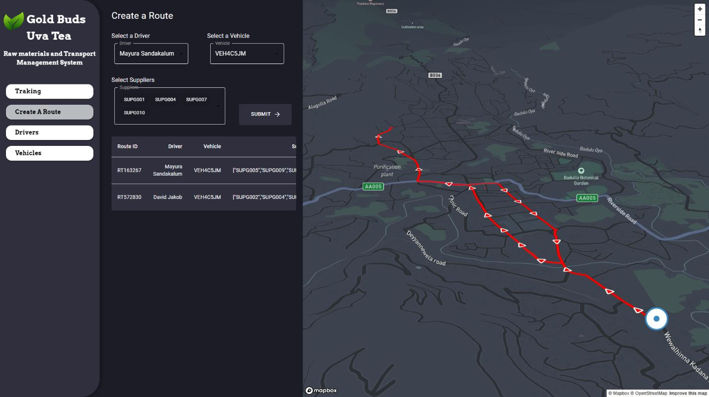

## Breast Cancer Detection
This project focuses on the classification of breast cancer tumors as benign or malignant using advanced machine learning techniques. Utilizing the Breast Cancer Wisconsin (Diagnostic) Data Set, I embarked on a comprehensive journey through data preprocessing, exploratory data analysis, model building, and evaluation.
- 
- Tags: Shop Customer Segmentation
- Badges:
  - Classification [cyan]
  - Feature Engineering [orange]
  - Accuracy Assessment [purple]
  - Hyperparameter Tuning [yellow]
  - Cross-Validation [pink]
  - Performance Metrics [brown]
- Buttons:
  - Github Repo [https://github.com/mayurasandakalum/breast-cancer-detection]

## Shop Customer Segmentation
Customer segmentation using K-Means clustering, including data preprocessing, visualization, standardization, one-hot encoding, model training, evaluation, and saving/loading the model
- 
- Tags: Shop Customer Segmentation
- Badges:
  - K-Means [cyan]
  - data preprocessing [green]
  - visualization [red]
  - standardization [teal]
  - model training & evaluation [blue]
- Buttons:
  - Github Repo [https://github.com/mayurasandakalum/shop-customer-data-clustering.git]

## Raw Material Transport app

- 
- Badges:
  - React.js [cyan]
  - Node.js [green]ddd
  - Mongo DB [red]
  - Material UI [teal]
  - Mapbox [blue]
  - Socket IO [white]
- Buttons:
  - Github Repo [https://github.com/mayurasandakalum/raw-material-transport-app]